# Project 2: Design Journey

**For each milestone, complete only the sections that are labeled with that milestone.** Refine all sections before the final submission.

You are graded on your design process. If you later need to update your plan, **do not delete the original plan, leave it in place and append your new plan _below_ the original.** Then explain why you are changing your plan. Any time you update your plan, you're documenting your design process!

**Replace ALL _TODOs_ with your work.** (There should be no TODOs in the final submission.)

Be clear and concise in your writing. Bullets points are encouraged.

**Everything, including images, must be visible in _Markdown: Open Preview_.** If it's not visible in the Markdown preview, then we can't grade it. We also can't give you partial credit either. **Please make sure your design journey should is easy to read for the grader;** in Markdown preview the question _and_ answer should have a blank line between them.

## Understanding Users (Milestone 1)

**Make the case for your decisions using concepts from class, as well as other design principles, theories, examples, and cases from outside of class.**

You can use bullet points and lists, or full paragraphs, or a combo, whichever is appropriate. The writing should be solid draft quality but doesn't have to be fancy.

### User Interview Questions (Milestone 1)
> Plan the user interview which you'll use to identify the goals of your site's audience.
> You may use the interview template below and revise it as much as you desire.
> You are **required to author 3 of your own questions**.

**User Interview Briefing & Consent:** Hi, I am a student at Cornell University. I'm currently taking a class on web design and for a project, I am re-designing the website for Ithaca's Apple Harvest Festival. I'm trying to learn more about the people that might use this site. May I ask you a few questions? It will take about 10 minutes. You are free to quit at any time.

(These questions assume you are interviewing a festival attendee at the festival. If you didn't attend the festival, you may revise the questions and instead ask the participant to recall the last festival/event they attended. Do not ask them to speculate about visiting the Apple Harvest Festival. User speculation provides biased data.)

1. Please tell me a bit about yourself. You may omit any personal or private information.

2. What brought you to visit the Apple Harvest Festival today?

3. Before you came to the festival today, did you seek out any information about the festival before getting here?
3a. If yes, What information were you specifically looking for? Did you find it? How did you access that information?

4. When you arrived at the festival, did you seek out any information about the festival?
4a. If yes, What was that information? How did you obtain it?

5. Now that you're here participating in the festival, have you sought out information about the festival?
5a. If you chose to look for information while at the Apple festival, how did you do so? If not, then what prevented you from seeking information while at the Apple festival?

6. While at the Apple festival, how did you decide what to do throughout the day? 6a. If you made a plan your visit in any way, how did you obtain that information?
7. Is there anything you saw or experienced at Apple festival that you with you knew about earlier, like an event, performance, or booth? If so, then can you describe what you wish you knew about earlier?
8. If you decided to go to Apple Festival next year, what is something you would do differently?

...

n. What haven't I asked you today that you think would be valuable for me to know?

**After the interview:** This was really helpful. Thank you so much for agreeing to speak with me today. Have a great day!

### Interview Notes (Milestone 1)
> Interview at least 3 people from your audience. Take notes and include those notes here. Make sure to include a brief description of each interviewee.
> **Copy the interview questions above into each interviewee section below.**
> Take notes for each participant inline with the questions.

**Interviewee 1:**

This participant is a 21 year old female student at Cornell university. They are a junior studying Civil Engineering, and this is their first time at the Apple Harvest festival.

1. Please tell me a bit about yourself. You may omit any personal or private information.

Male student, sophomore, studying computer science at Cornell University. Has been to the Apple Harvest Festival once before and is a member of a club that performs during the festival.

2. What brought you to visit the Apple Harvest Festival today?

He came to the Apple Harvest Festival to perform with his club and to enjoy the festive atmosphere.

3. Before you came to the festival today, did you seek out any information about the festival before getting here?
3a. If yes, What information were you specifically looking for? Did you find it? How did you access that information?

Yes, before coming to the festival the interviewee looked online for information about the festival. She looked specifically for the time of the event as well as general things to do. She accessed this information through the internet.

4. When you arrived at the festival, did you seek out any information about the festival?
4a. If yes, What was that information? How did you obtain it?

When she arrived at the festival, she looked for a map of the festival grounds and a list of vendors to help me plan out my day. She did not find a map but was still able to explore a lot of what the festival had to offer.

5. Now that you're here participating in the festival, have you sought out information about the festival?
5a. If you chose to look for information while at the Apple festival, how did you do so? If not, then what prevented you from seeking information while at the Apple festival?

Interviewee did not actively seek out information while at the event, but did walk around and try to explore what the festival had to offer.

6. While at the Apple festival, how did you decide what to do throughout the day? 6a. If you made a plan your visit in any way, how did you obtain that information?

Interviewee made rough plans which only included going a few food booths, but those events were not time sensitive. They did want to see a performance by a few clubs. They obtained this information froman online resource that they could not recall at the time.

7. Is there anything you saw or experienced at Apple festival that you with you knew about earlier, like an event, performance, or booth? If so, then can you describe what you wish you knew about earlier?

The interviewee said that they walked in on a music group that they wished they started watching earlier since they really enjoyed it.

8. If you decided to go to Apple Festival next year, what is something you would do differently?

The interviewee said that they if they came back next year, they would want to plan out the event more and come at an earlier time.

**Interviewee 2:**

This person is a male student at Cornell university studying computer science as a Sophmore. This is their second year at Apple festival. They also perform during the festval with the club they are in.

1. Please tell me a bit about yourself. You may omit any personal or private information.

Student, sophomore, studying computer science at Cornell University. Has been to the Apple Harvest Festival once before and is a member of a club that performs during the festival.

2. What brought you to visit the Apple Harvest Festival today?

He came to the Apple Harvest Festival to perform with his club and to enjoy the festive atmosphere.

3. Before you came to the festival today, did you seek out any information about the festival before getting here?
3a. If yes, What information were you specifically looking for? Did you find it? How did you access that information?

Before coming to the festival, he did not seek out any additional information about the festival since he has been here before and is familiar with the layout and events.

4. When you arrived at the festival, did you seek out any information about the festival?
4a. If yes, What was that information? How did you obtain it?

When he arrived at the festival, he did not seek out any additional information since he is already familiar with the festival, and he knew what locations he wanted to go to before coming.

5. Now that you're here participating in the festival, have you sought out information about the festival?
5a. If you chose to look for information while at the Apple festival, how did you do so? If not, then what prevented you from seeking information while at the Apple festival?

Interviewee did do some additional research about where to eat with his club while at the festival. He did this by looking at google maps to find restaurants near him.

6. While at the Apple festival, how did you decide what to do throughout the day? 6a. If you made a plan your visit in any way, how did you obtain that information?

He decides what to do throughout the day based on his performance schedule with his club and by exploring the festival. He did not make a specific plan for his visit but is familiar with the layout of the festival well.

7. Is there anything you saw or experienced at Apple festival that you with you knew about earlier, like an event, performance, or booth? If so, then can you describe what you wish you knew about earlier?

The interviewee said that they wished that they knew about good restaurants in the area, since the one they ended up going took a really long time to serve them food because of the demant.

8. If you decided to go to Apple Festival next year, what is something you would do differently?

The interviewee said that they would go to a different restaurant, possibly one that makes food quickly so that his club can eat together without taking a long time to wait.

**Interviewee 3:**

This participant is a male 34 year old Ithaca resident. They grew up in Ithaca and have been to the Apple festival many times.

1. Please tell me a bit about yourself. You may omit any personal or private information.

Male, 34 years old, resident of Ithaca. Grew up in Ithaca and has been to the Apple Harvest Festival many times. Works as a graphic designer.

2. What brought you to visit the Apple Harvest Festival today?

He came to the Apple Harvest Festival with his friends as it is a yearly tradition for them. They enjoy eating out and supporting their local vendors.

3. Before you came to the festival today, did you seek out any information about the festival before getting here?
3a. If yes, What information were you specifically looking for? Did you find it? How did you access that information?

Before coming to the festival, he sought out information about when certain clubs were performing. He did this through the Apple festival webiste. He also looked up what the weather was going to be like from the weather app on his phone.

4. When you arrived at the festival, did you seek out any information about the festival?
4a. If yes, What was that information? How did you obtain it?

When he arrived at the festival, he did not seek out any additional information since he is already familiar with the festival and the local area.

5. Now that you're here participating in the festival, have you sought out information about the festival?
5a. If you chose to look for information while at the Apple festival, how did you do so? If not, then what prevented you from seeking information while at the Apple festival?

Since he is already familiar with the festival, he did not actively seek out any additional information about it while participating. He did ask his friends if they knew about any new food vendors that were there.

6. While at the Apple festival, how did you decide what to do throughout the day? 6a. If you made a plan your visit in any way, how did you obtain that information?

He decides what to do throughout the day based on his personal interests, such as trying new foods, listening to live music, and visiting vendor booths. He did not make a specific plan for his visit.

7. Is there anything you saw or experienced at Apple festival that you with you knew about earlier, like an event, performance, or booth? If so, then can you describe what you wish you knew about earlier?

He mentioned that he wished he knew more about the groups that were performing, such as what kind of performance they did, but not much else other than that.

8. If you decided to go to Apple Festival next year, what is something you would do differently?

Interviewee generally thinks that there is not much else he would do differently next year.

### Goals (Milestone 1)
> Analyze your audience's goals from your notes above.
> List each goal below. There is no specific number of goals required for this, but you need enough to do the job (Hint: It's more than 1 and probably more than 2).

Goal 1: Provide an image of a map of the festival

- **Design Ideas and Choices** _How will you meet those goals in your design?_
  - An image of the map of the Apple festival will be front and center on the home page in a format that likely covers the full width. The map may be an in-line element on the home page or have a seperate dedicated page.

- **Rationale & Additional Notes** _Justify your decisions; additional notes._
  - The current website has the option to download a map, however, this small extra step seems to be a deterrence for some people who then decided to just wonder around the festival. Also, having the map readily accessable on the website would benefit mobile users who might know how to access downloaded files on their phone.

Goal 2: Give more information about restaurants and food vendors on Apple festival weekend.

- **Design Ideas and Choices** _How will you meet those goals in your design?_
  - Provide a list of resturants that are open during the Apple festival, as well as temporary food vendors that are there just for the festival. Also, the list will provide locations, descriptions, as well as how full those institutions get during peak hours.
- **Rationale & Additional Notes** _Justify your decisions; additional notes._
  - Becase many people attend the Apple festival, many festival goers might not realize how full some restaurants might get and lead to very long wait

Goal 3: Provide a more thorough descriptions of performances or groups/clubs that are performing

- **Design Ideas and Choices** _How will you meet those goals in your design?_
  - Provide a list of groups that are performing along with a description of the group, brief history, time, and possibly a picture of the group performing.
- **Rationale & Additional Notes** _Justify your decisions; additional notes._
  - Performances are a big part of the festival, as not only do festival goers experience something fun but also residents in the community or students at Cornell get to perform and express themselves, so having a thorough description of events will likely give the audience more information about performances increasing their chance to get to experience something they would have missed otherwise.

### Audience (Milestone 1)
> Briefly explain your site's audience.
> Be specific and justify why this audience is a **cohesive** group with regard to the Ithaca Apple Harvest Festival. .

nearby (30min) area residents

## Festival/Event Website Design Exploration (Milestone 1)

Identify three festival or event websites (preferably static websites) that exist today on the web. You will be drawing inspiration from these sites for your own site; please select websites that are similar to the website you wish to create.

Include two screenshots of the home page for each site: narrow and wide.

**We'll refer to these are your "example websites."**

1. <https://nationalcherryblossomfestival.org/>

    

    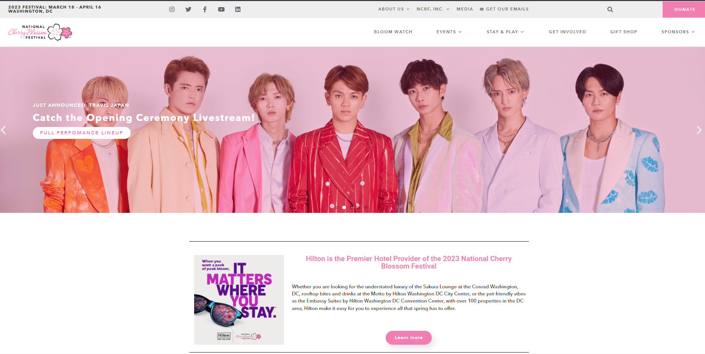

2. <https://pasic.org/>

    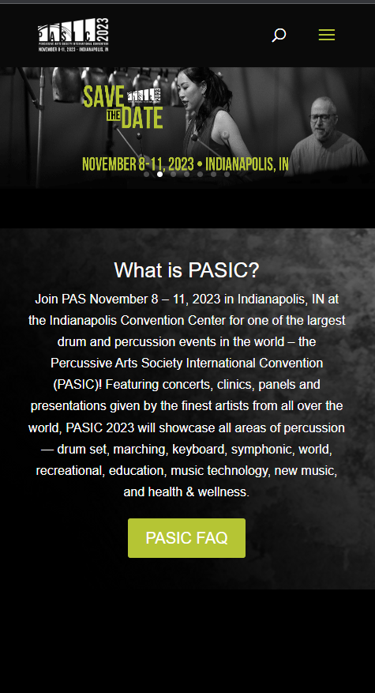

    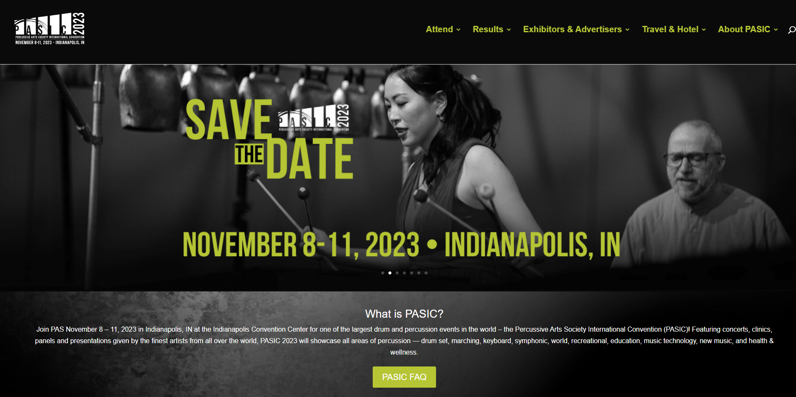

3. <https://www.clevelandfilm.org/>

    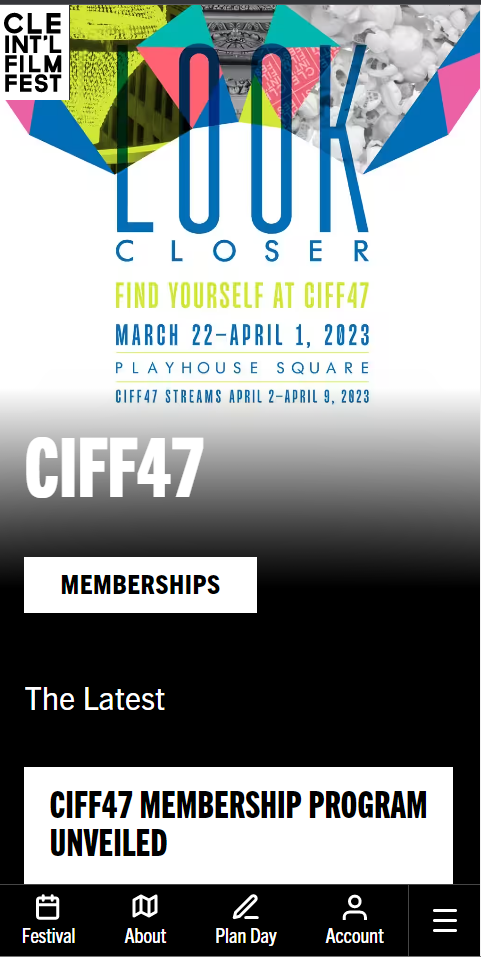

    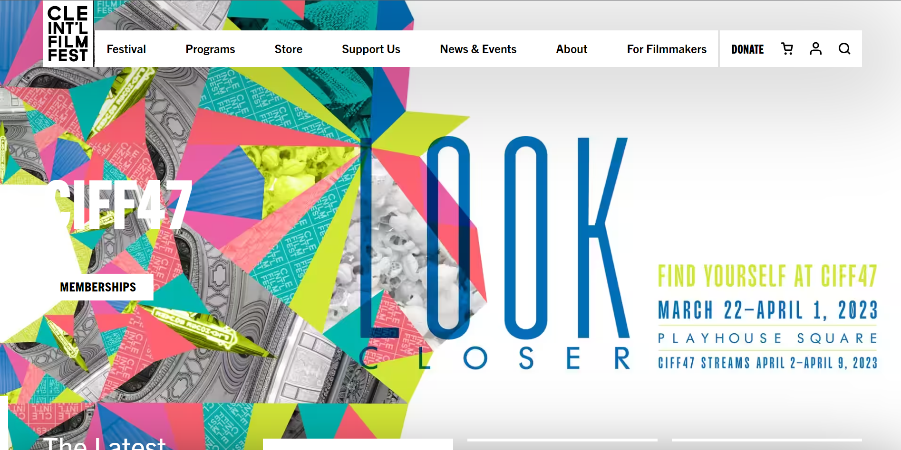

### Festival/Event Website 1 Review (Milestone 1)
> Review the website you identified above. (1 paragraph)
> In your review, include a discussion common design patterns in the site.

The first thing we see in website one is the striking pink photo banner. This is seen regardless of screen size. There is also a link and some text on said banner, which is effective at drawing the users attention to the most important link, which is purchasing tickets. We also see that in the wide view, there is a navigation bar that is in line with the logo, providing the user with quick access to different pages. In the narrow version, this bar is turned into the hamburger condensed navigation bar. Despite the differences in width, both versions succeed at conveying the same information. The website also keeps a consistant theme of pink and light colors.

### Festival/Event Website 2 Review (Milestone 1)
> Review the website you identified above. (1 paragraph)
> In your review, include a discussion common design patterns in the site.

This website keeps a consistant theme of black and green, which creates a unique, underground look for the website. We see that if also has a photo gallary with contrastign text on the photos. It also has a nav bar that is inline with the logo, and turns it into the hamberger condensed navigation in the mobile form. In the mobile form, the photo gallary keeps its hiehgt proportion as with the wide format, which makes the photos look very small in mobile form.

### Festival/Event Website 3 Review (Milestone 1)
> Review the website you identified above. (1 paragraph)
> In your review, include a discussion common design patterns in the site.

This site keeps a theme of bright colors and white, which conveys a very createive feeling. This site does not have a photo gallary but a static background that changes based on the width of the screen. In the wide version, the background image makes the forground text very hard to read as it is white text on a white background. This site has a top navigation bar in teh desktop version, but on mobile this navigation bar shrinks and moves to the bottom, possibly to make the nacigation bar closer to the thumbs of the user.

## Content Planning (Milestone 1)

Plan your site's content.

### Your Site's Planned Content (Milestone 1)
> List **all** the content you plan to include your website.
> You should list all types of content you planned to include (i.e. text, photos, images, etc.)

- Photos of the event or past events
- Description of what the festival is as well as it's history
- Image of the map of the event
- Schedule of performances and descriptions of performances
- Pictures of Performers
- Photos of restaurants
- list of restaurants in the area as well as description
- list of booths or vendors that will be at the festival
- Parking and public transportation information
- Predicted weather during time of event

### Content Justification (Milestone 1)
> Explain (about a paragraph) why this content is the right content for your site's audience and how the content addresses their goals.

My audience is those within close proximity of the Ithaca commons. So they will value knowing information about public transportation and parking, as parking is usually an issue with festivals and those close enough to take the bus would usually take the bus, as many students at Cornell do not have a car. Descriptions and images of the festival will give students, who live close and haven't gone to apple festival before, an idea of what the festival is. Descriptions and lists of performances, restaurants, and booths/vendors is useful information for everyone, as these may change from year to year no matter how many times you have attendted the festival. Those who live in the area also know how volitile the weather in Ithaca could be, so konwing the predicted weather is helpful for them.

## Information Architecture (Milestone 1)

### Content Organization (Milestone 1)
> Document your **iterations** of card sorting here. You must have at least 2 iterations of card sorting.
> Include photographic evidence of each iteration of card sorting **and** description of your thought process for each iteration.
> Please physically sort cards; please don't try and do this digitally.

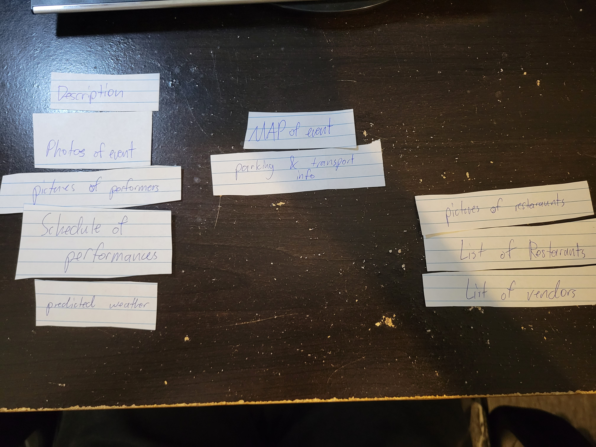

The thinking behind Iteration 1 is that the home page will of course contain the desption and photos of the event as this is where people new to the event will most likely go. One other big attractor of people for the festival is the performances, so this is where the schedule and picures of performers go. Another page is dedicated to the map, which will allow the map to take up a lot of space so that it is clear where certain events are. Parking is also put here since if someone were looking for parking, they would likely first look for a map of the event. The final page will be everything on food, as food was another major aspect of individual's experiences at Apple festival

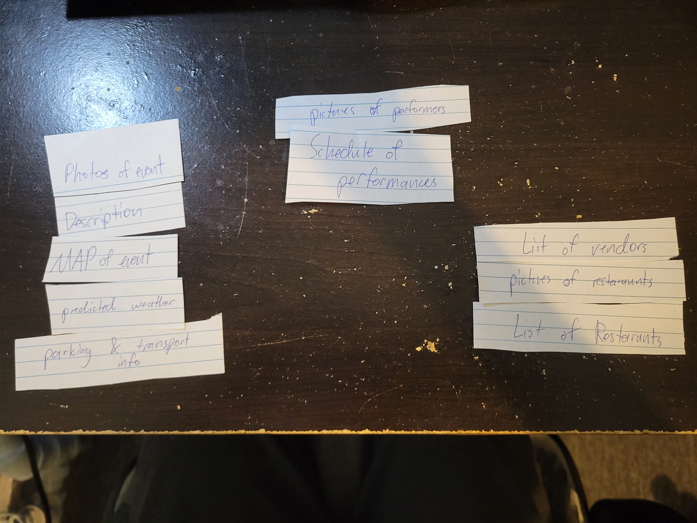

Iteration 2 will start with the home page containing photos of the event and description with the same reasoning as listed in the first iteration description. The map will also be put on the home page since seeing a map of the event immediatly upon opening the website would be helpful for users who are new to the festival, such as new students at Cornell. Parking information is also vital for attending the event, so it is also listed on the home page. Another page will be dedicated to pictures and schedule of performances, which are a major part of the fesival. A seperate page for vendors and food also exists for the same reason as the performance page.

### Final Content Organization (Milestone 1)
> Which iteration of card sorting will you use for your website?

I will use the second Iteration, Iteration 2.

> Explain how the final organization of content is appropriate for your site's audiences.

This iteration is beneficial for the audience's goals because it creates a seperate page for perofrmances as well as vendors. This is useful since these are likely the things that those living close to the festival, whether Cornell students or local Ithaca residents would need to check.

### Navigation (Milestone 1)
> Please list the pages you will include in your website's navigation.

- Home page
- Performances
- Food

> Explain why the names of these pages make sense for your site's audience.

These navigations names are useful for the audience because they follow traditional navigation names. They also make sense since the names are a short one word description of the page.

## Visual Theme (Milestone 1)
> Discuss several (more than two) ideas about styling your site's theme. Explain why the theme ideas are appropriate for your target audiences. Note the theme you selected for your site and why it's appropriate for the audience and their goals.

Theme idea 1: generally light and a few brigh colors, such as blue, red, or orange. This is appropriate for the audience since it is not straining on the audience's eyes and convey a fun attitude.

Theme idea 2: A fun theme that relies heavily on colors such as red. This would convey to the audience that the festival is fun and exciting.

## Design (Milestone 1)

Document your site's layout.

### Layout Exploration (Milestone 1)
> Iterate on your site's design through sketching.
> Sketch both the narrow and wide versions of the site.
> Here you are just exploring your layout ideas. You don't need to sketch every page.
> Provide an explanation for each sketch explaining the idea and the design patterns you are leveraging.
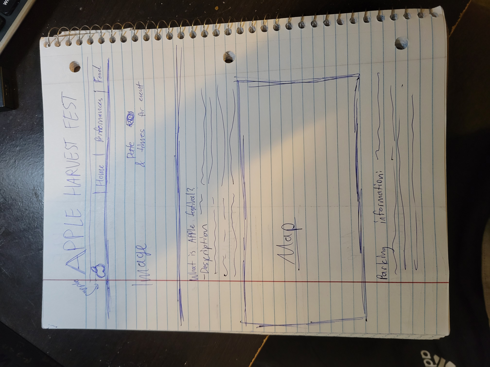
The reasoning for this design is that it provides ample room for images of exciting new performances. The text takes up relatively little space, while important things such as the date and times and map are present in the wider format. The navigation bar is at the top and is put tot he right side to not take away from the content.

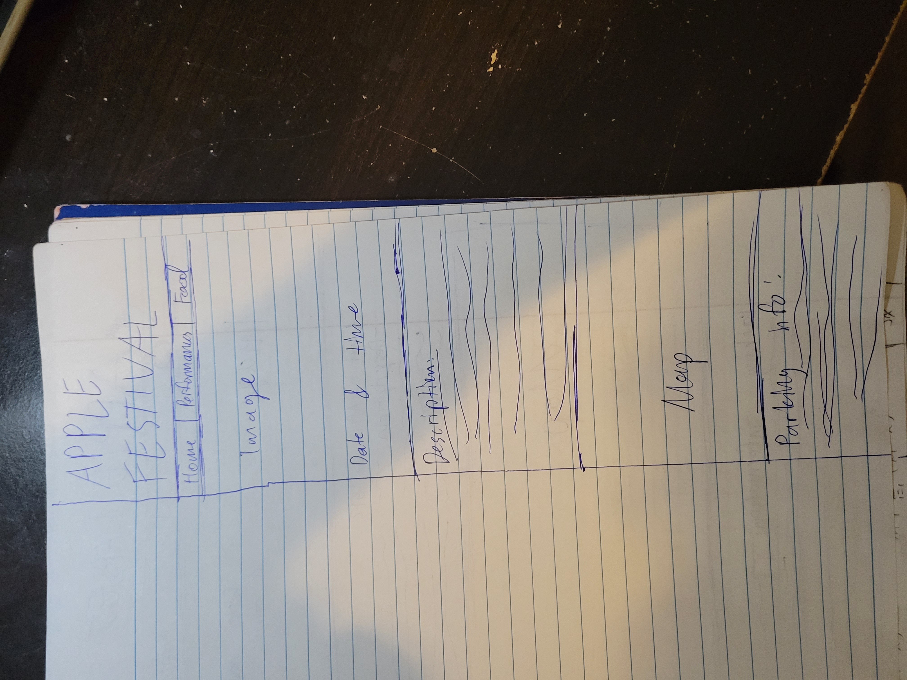
The reasoning for this layout is that it conveys the same information as the wider format but adjusted to make the experience easier. The large letters at the top are kept but have to wrap around to keep the consistant branding. The navagation bar is no longer put to the right, but is centered for spacing. Images and the map are naturally smaller but not cropped. The date and time is not put on the right side of the image, but now at the bottom of the image to not obstruct the images.

### Final Design (Milestone 1)
> Include the final sketches for each of your pages.
> The sketches must include enough detail that another 1300 student could implement them.
> Provide an explanation for each sketch.

**Narrow (Mobile) Design:**

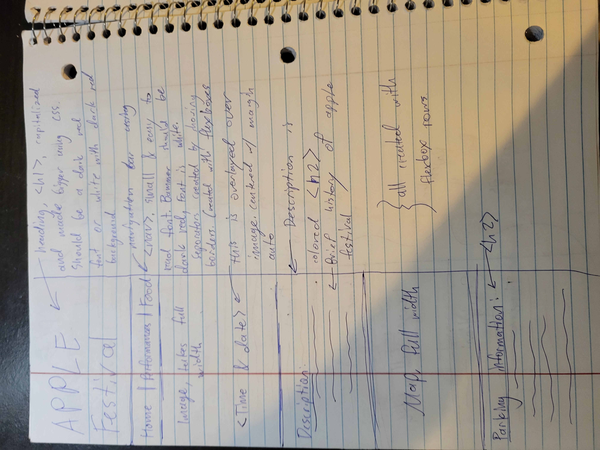
This is the home page for the narrow layout. We can see that it uses the wraped heading, and centered navigation bar. We still include the shrinked center image, and the overlaying text is at the bottom for previously explained reasons. We also include descriptions and a smaller map, each using a class that is specified for the narrow width, including images, h2, h1, and h3. Images are scaled to use the full width since padding would make them look very small.

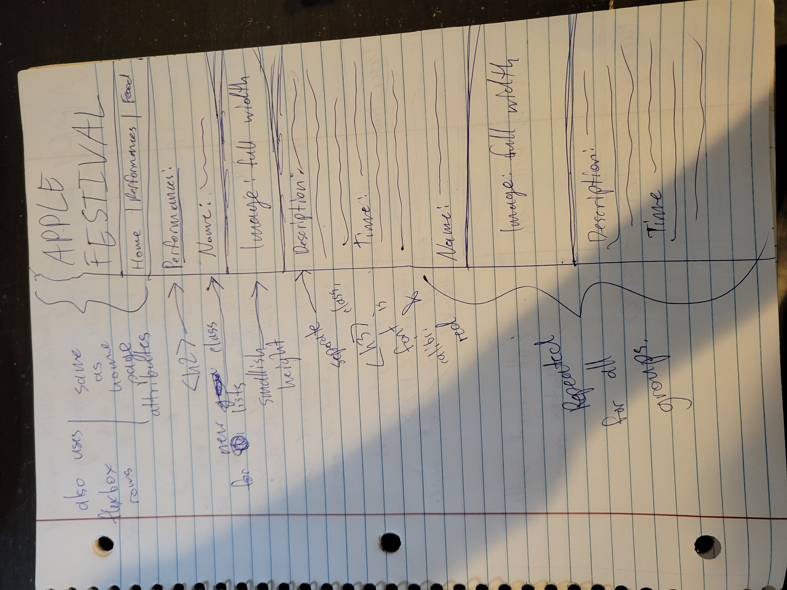
Here we see this uses the same heading and navigation bar. We utilize the same image layout, headings, and text classes from before to make an organized list that is easy to scroll through.

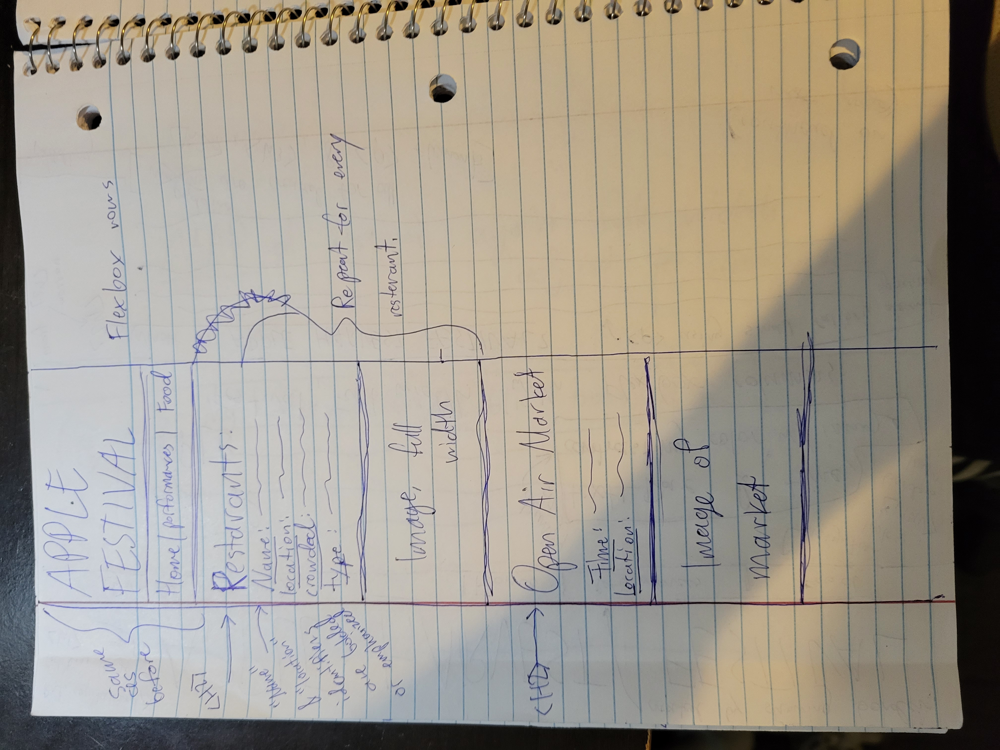
Aagain, we utilize that same stylings, header, and navigation bar, altered to display information about food vendors and the open air market.

**Wide (Wide) Design:**

Here, we make use of the same stylings as the narrow format, but we change certain aspects in reaction to the wide format. This includes things like size, margins, and paddings. The header now no longer wraps around and is bigger. The navigation bar puts the page options to the riht instead of the center. The first image on the home page and the map take the width of the full page, but every other image includes some padding and is in a flexbox column with other text.

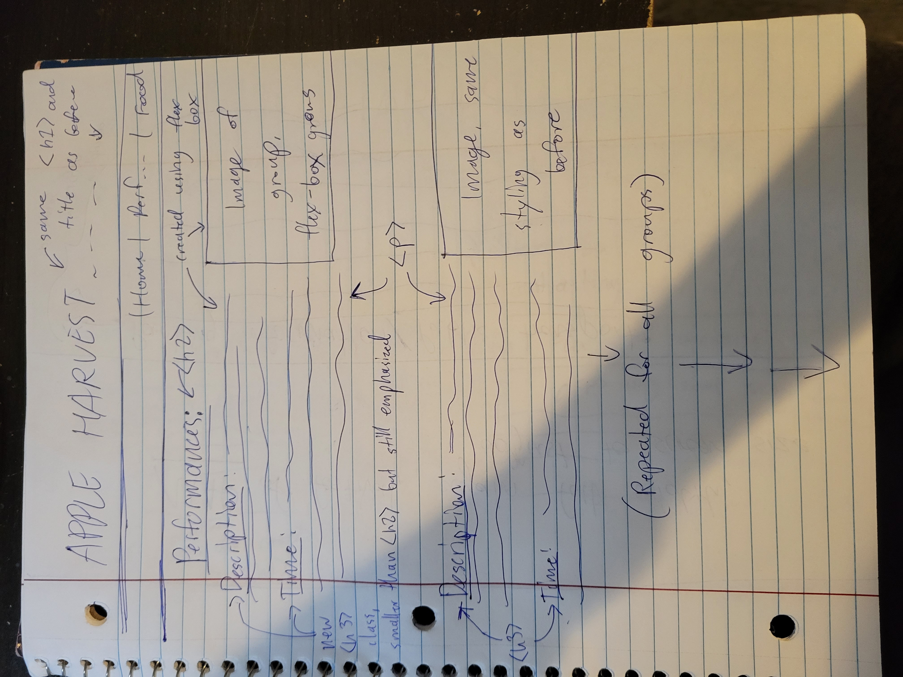
This perforamnce page again uses the elements defined in classes for the wide format. The images and descriptions are put in a flexbox column, so images are next to their descriptions. This is repeated for all performances.

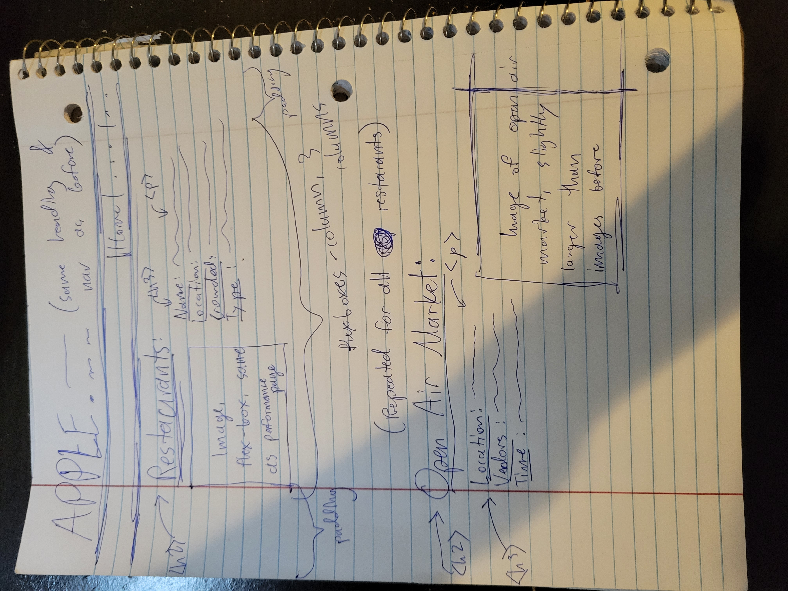
This page follows a similar format as the performance page, but now the images are put on the right for variety.

### Design Rationale (Milestone 1)
> Explain why your design is appropriate for your audience.
> Specially, why does your content organization, navigation, and site design/layout meet the goals of your users?
> How did you employ **design patterns** to improve the familiarity of the site for your audience?

This design is appropriate for my audience since it is user friendly and familiar. It utilizes an intuitive navigation bar that many people are familier with, from young ithaca residents and students, to older Cornell and Ithaca College faculty or new york residents. Because my audeicne includes people who live close by, having that parking information be easily accessable and on the home page is very convienient for them.

## User Testing (Final Submission)

### User Testing Tasks (Final Submission)
> Plan out your user testing tasks before doing your user testing.
> These must be actual user testing tasks.
> **Tasks are not questions!**

1. Identify two performances that are occuring on the two separate days of the Apple Harvest Festival, and provide a brief description of each group.

2. Identify areas in the Ithaca commons that have public parking and how to get from those areas to the food vendors and music stage.

### Participant 1 (Final Submission)
> Using your notes from above, describe your user by answering the questions below.

1. Who is your user, e.g., where does the user come from, what is the user's job, characteristics, etc.?

  My user is a male Sophomore from Virginia studying Information Science and Government. He does not have a job. He likes computers and interactiving with technology. He has never been to Apple Festival but wants to go.

2. Does the user belong to your audience of the site?

    > If “No”, what’s your strategy of associating the user test results to your audience’s needs and wants? How can your re-design choices based on the user tests make a better fit for the audience?

    (Yes)

### Participant 1 -- Testing Notes (Final Submission)
> When conducting user testing, you should take notes during the test.

      Task 1: After briefly looking at the screen, and participant noticed the events tab in the top right corner and clicked on it. From there, he scrolled through the performances an starte looking at the times that the perforamnces were. After mores scrolling, he successfully identified two perforamnces that were happening on two seperate days, the Rachel Beverly and Ageless Jazz band perforamnce. He also provided a brief description of each group.
      Task 2: The participant then clicked on the Food tab and briefly scrolled through the food tab, before clicking back onto the home tab. He then began scrolling, until he found a map. He then proceeded to look for the free parking space on the map, as well as the food vendors, and identified them correctly.

### Participant 2 (Final Submission)
> Using your notes from above, describe your user by answering the questions below.

1. Who is your user, e.g., where does the user come from, what is the user's job, characteristics, etc.?

    The second participant is also a Sophomore at Cornell University studying Environmental Engineering. She is from Ithaca and has been to Apple Festival many times before.

2. Does the user belong to your audience of the site?

    > If “No”, what’s your strategy of associating the user test results to your audience’s needs and wants? How can your re-design choices based on the user tests make a better fit for the audience?

    (Yes)

### Participant 2 -- Testing Notes (Final Submission)
> When conducting user testing, you should take notes during the test.

    Task 1: The user first starts with scrolling through the home page, which she continuoud to do so until she reached the tcat bus schedule. She then scrolled back up, then clicked on the events tab. She then successfully provided the times and descriptions for two performances on two separate days.
    Task 2: The user immediately went back to the map on the home tab to successfully locate the free parking spcae and food vendor and music space. She did this after remembering the map she saw on the home page.

### Participant 3 (Final Submission)
> Using your notes from above, describe your user by answering the questions below.

1. Who is your user, e.g., where does the user come from, what is the user's job, characteristics, etc.?

    The third participant is a male alumni of Cornell who still lives in the area. He works at a large tech firm and is intimately familiar with technology. He has been to Apple festival several times before.

2. Does the user belong to your audience of the site?

    > If “No”, what’s your strategy of associating the user test results to your audience’s needs and wants? How can your re-design choices based on the user tests make a better fit for the audience?

    (Yes)

### Participant 3 -- Testing Notes (Final Submission)
> When conducting user testing, you should take notes during the test.

  Task 1: After briefly looking at the screen, the participant went to the events tab and started scrolling through looking at the various performances. He was then able to successfully identify two performances that were happening on two seperate days and a description of them.
  Task 2: The participant breifly finished scrolling through the events page, then proceeded to scroll through the food page to find a map. After failing to find one, the participant then went back to the home page and ascrolled through until they found a map and successfully completed the task.

### Potential Changes Based on User Testing (Final Submission)
> What changes would you make to your design based on user testing?
> Note: You are not required to change your design. Simply tell  us what you would change.

Based on the user testing, the main thing I would do is change where the map is located. Either put it higher up on the home page or create a seperate page jsut for the map. I would also make the events page not as long, by making the descriptions and pictures smaller or making a wider flexbox for the blocks.

## Rationale (Final Submission)

**This rationale should be polished writing:** one you might submit as a report to a client or boss to help explain the project and convince them you did a good job. You'll be surprised how much writing and communicating you need to do about projects and choices on internships and jobs; practice that here.

It should be a comprehensive, complete story of the project. You might find that each section runs about a paragraph. Sketches can often help tell the story of your design.

Your rationale should be a polished version of the earlier explanations.

### Audience (Final Submission)
> A complete and polished description of the intended audience(s) for your website.

The intended audience for this website are students who attend university in the local Ithaca area as well as Ithaca residents who have attended the Apple Harvest Festival before or have not.

### Audience Goals
> Explain how your site's design addresses the goals of the audience.

My website addresses the goals of my audeince. For students who are looking to attend Applefest for the first time, the webiste immediatly gives the users a description of what the Apple Harvest Festival is about and its location. It also provides a map of the event and easily accessible tabs for events and food options for new Apple Festival goers. For veteran Apple Festival attendees, my design improves on the previous design by providing them certain times in which their favorite restaurants are busy and when they are not. It also provides much more detailed descriptions of events in case they have never seen a group perform and wanted to.

### Visual Design (Final Submission)
> An explanation of how the final design is appropriate for your audience.
> Include design patterns in your rationale.

The final design incorperates a casual yet inviting atmosphere that is pleasing for both newcomers and veteren festival goers. The red, green, and oragen color scheme also gives the audience an idea of what the festival is about: apples. The fonts are well spaced so that they are easy to read, and the font itself is casual. The flexbox designs give each element enough space for ease of use as well as a repeated pattern to not confuse users. Also, the navigation bar below the top banner is an element that is shared with many other websites.

### Self-Reflection (Final Submission)
> Take some time here to reflect on how much you've learned since you started this class. It's often easy to ignore our own progress. Take a moment and think about your accomplishments in this class. Hopefully you'll recognize that you've accomplished a lot and that you should be very proud of those accomplishments!

I learned more about the possibilities of flexboxes and how to more effectively use them. I also learned the importance of using div elements for better styling elements.

## Grading (Final Submission)

### Collaborators
> List any persons you collaborated with on this project.

None

### Reference Resources
> Please cite any external resources you referenced in the creation of your project.
> (i.e. W3Schools, StackOverflow, Mozilla, etc.)

StackOverflow, W3Schools
